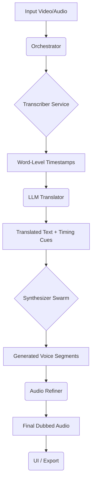

# SONORA: SYSTEM SYSTEM MAP (v1.1)

Sonora is an advanced AI Dubbing Studio designed for high-fidelity voice cloning, surgical translation, and precise audio-visual alignment. This document provides a structural overview for AI-driven development within Google AI Studio.

## 🏗️ Core Architecture

Sonora follows a **Hybrid Microservice/Orchestration** pattern.

### 1. Orchestration Layer (`sonora/core/`)
- **`orchestrator.py`**: The "Brain". Manages the pipeline: `Transcription -> Translation -> Synthesis -> Post-Processing`.
- **`project_manager.py`**: Handles session state, file path resolution via `path_manager.py`.
- **`studio_master.py`**: High-level interface for the UI to interact with the orchestration logic.

### 2. Audio Processing Engine (`sonora/core/`)
- **`vibe_voice.py`**: Integration with VibeVoice TTS.
- **`step_audio_refiner.py`**: Spectral matching and refinement to match source audio characteristics.
- **`emotional_splicer.py`**: Handles emotion preservation and splicing segments.
- **`bus_mixer.py`**: Multi-track audio mixing and management.

### 3. Service Layer (`src/services/` & `src/providers/`)
- **`transcriber/`**: Whisper-based ASR (Automatic Speech Recognition).
- **`separator/`**: Demucs/AudioSeparator for vocal/instrumental separation.
- **`synthesizer/`**: TTS and Lip-Sync (Wav2Lip) services.
- **`providers/qwen3/`**: Next-generation local TTS integration (currently in evolution).

### 4. Reliability & Infrastructure (`src/core/`, `sonora/utils/`)
- **`reliability.py`**: Exponential backoff, retry logic, and device detection (CPU/GPU).
- **`settings.py`**: Centralized configuration management.

---

## 🔄 Data Flow (The Atomic Handshake)

---

## 🛠️ Critical Logic Components

### Transcription & Alignment
Uses word-level timestamps to ensure the translated text fits the original duration. The `Orchestrator` computes "Surgical Deltas" to replace only specific segments of audio.

### CPU-Hardened Execution
All services detect the available hardware and default to CPU if CUDA is unavailable, ensuring portability across environments without specialized GPU drivers.

### Retry-with-Fallback
The system uses a "Primary/Secondary" provider pattern. If a high-fidelity provider (like Qwen3) fails or times out, it automatically falls back to a stable baseline (VibeVoice).

---

## 📂 Export Manifest (Logic-Only)
This export includes all `.py`, `.md`, `.txt`, `.json`, and configuration files required to understand and extend Sonora's logic. **Large model weights and binary assets are excluded.**
